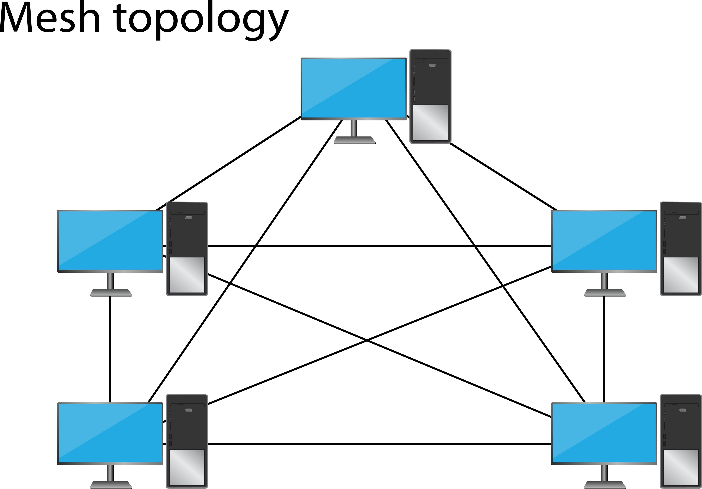

# VideoCall

Um sistema de videochamada via navegador (estilo Google Meet) desenvolvido em **Python (Flask)** e **JavaScript**. O projeto utiliza **WebRTC** para comunicação em tempo real e inclui processamento de áudio avançado para filtragem de ruídos.

Este projeto foi desenvolvido como atividade acadêmica para a disciplina de Sistemas Distribuídos/Multimídia, focando na implementação de um protótipo funcional de *Live Streaming*.

---

## 🚀 Funcionalidades

* **Comunicação P2P:** Vídeo e áudio direto entre os participantes (arquitetura Mesh).
* **Áudio Inteligente (Híbrido):**
    * **No PC:** Sistema de *Noise Gate* (Portão de Ruído) e Equalização via Web Audio API para bloquear sons de teclado mecânico e cliques de mouse.
    * **No Celular:** Otimização automática para usar o hardware nativo do aparelho, economizando bateria e evitando a "voz robótica".
* **Monitor de Conexão:** Alerta visual em tempo real caso a conexão caia.
* **Segurança Local:** Geração automática de certificados HTTPS (SSL) para permitir acesso à câmera na rede local.
* **Interface Responsiva:** Layout fluido que se adapta a Monitores e Smartphones.

---

## 📂 Estrutura de Arquivos

```text
/
├── app.py              # O Cérebro (Servidor Flask + Socket.IO)
├── Makefile            # Automação (Instala, configura e roda com 1 comando)
├── requirements.txt    # Lista de dependências Python
├── .env                # Configurações sensíveis (IP e Certificados)
├── certs/              # Pasta gerada automaticamente com as chaves de segurança
├── templates/
│   └── index.html      # A Interface (HTML)
└── static/
    ├── style.css       # O Design (CSS Responsivo)
    └── script.js       # A Mágica (Lógica WebRTC e Filtros de Áudio)
```

## ⚙️ Configuração Inicial (Obrigatório)
Antes de rodar, você precisa configurar o endereço IP e os dados do certificado.

1. **Criar o arquivo .env**
Crie um arquivo chamado .env na raiz do projeto e preencha conforme o modelo abaixo.

**Importante**: No campo WINDOWS_IP, coloque o IP do seu computador na rede Wi-Fi (descubra usando o comando ipconfig no terminal do Windows).

```console

# Dados para o Certificado de Segurança (Evita perguntas no terminal)
# Formato: /C=País/ST=Estado/L=Cidade/O=Organização/CN=Seu Nome/emailAddress=Email
CERT_SUBJ="/C=Br/ST=Goias/L=Goiania/O=VideoCall/CN=Admin/emailAddress=admin@teste.com"

# O IP do seu computador no Wi-Fi (Ex: 192.168.x.x)
# Isso garante que o link gerado no terminal funcione para o celular
WINDOWS_IP="192.168.XX.X"
```
## ▶️ Como Executar
#### Opção A: Modo Automático (Recomendado)
Se você tem o make instalado (padrão no Linux/WSL), basta rodar um comando. Ele cria o ambiente virtual, instala as bibliotecas, gera os certificados e inicia o servidor.

```console

make
```
### Opção B: Modo Manual
Se não tiver o make, siga estes passos sequenciais no terminal:

1. **Crie e ative o ambiente virtual:**

    ```console

    python3 -m venv venv
    source venv/bin/activate
    ```
2. **Instale as dependências:**

    ```console

    pip install -r requirements.txt
    ```
3. **Gere os certificados de segurança:**

    ```console
    mkdir -p certs
    openssl req -x509 -newkey rsa:4096 -nodes -out certs/cert.pem -keyout certs/key.pem -days 365
    ```
    (Aperte Enter para todas as perguntas se estiver fazendo manualmente).

4. **Rode o servidor:**

    ```console

    python3 app.py
    ```
## 📱 Guia de Uso (Como conectar o celular)
Como este é um projeto de desenvolvimento local, o certificado de segurança é auto-assinado (não validado por uma autoridade global como o Google), então o navegador vai emitir um alerta.

1. **Inicie o servidor** no seu PC. O terminal mostrará um link clicável, ex: https://192.168.15.4:5000.

2. **No Celular**, certifique-se de estar no mesmo Wi-Fi do PC.

3. Abra o navegador (Chrome/Safari) e digite o link exatamente como aparece no terminal.

4. **O Alerta de Segurança**: Vai aparecer uma tela vermelha ("Sua conexão não é particular").

    * Clique em **Avançado**.

    * Clique em **Ir para... (não seguro)**.

5. Permita o uso da câmera e microfone quando solicitado.

## ⚠️ Atenção para usuários WSL (Windows Subsystem for Linux)
Se você está rodando o código dentro do WSL, o celular não consegue enxergar o servidor diretamente, pois o WSL roda em uma "rede interna" do PC. Você precisa criar uma "ponte" no Windows.

Abra o **PowerShell como Administrador** e rode os comandos abaixo sempre que reiniciar o PC:

```console

# 1. Pegue o IP interno do WSL
wsl hostname -I  
# (Exemplo de resultado: 172.26.35.225)

# 2. Crie a ponte (Substitua o último número pelo IP que apareceu acima)
netsh interface portproxy add v4tov4 listenport=5000 listenaddress=0.0.0.0 connectport=5000 connectaddress=172.26.35.225

# 3. Libere o Firewall (Fazer apenas uma vez)
New-NetFirewallRule -DisplayName "Python Server" -Direction Inbound -LocalPort 5000 -Protocol TCP -Action Allow
```
## 📐 Engenharia do Sistema (Documentação Técnica)
Esta seção detalha os requisitos e a arquitetura, conforme solicitado na atividade acadêmica para o relatório estrutural e comportamental.

### Requisitos e Especificações
#### Requisitos Funcionais (RF)

1. **RF01 - Transmissão A/V**: Captura e transmissão de mídia (áudio e vídeo) em tempo real.

2. **RF02 - Multiusuário**: Suporte a salas dinâmicas onde múltiplos participantes podem entrar e sair a qualquer momento.

3. **RF03 - Tratamento de Áudio Híbrido:**

    * **Desktop**: Implementação de algoritmos DSP (Noise Gate e Filtros Passa-Baixa) via Web Audio API para supressão de ruídos mecânicos.

    * **Mobile**: Delegação de processamento para o DSP nativo do hardware móvel para evitar latência e distorção.

4. **RF04 - Sinalização**: Uso de WebSockets para troca de metadados de conexão (SDP/ICE) e estado da sala.

#### Requisitos Não-Funcionais (RNF)
1. **RNF01 - Latência**: Comunicação P2P direta para minimizar atrasos (RTT < 200ms).

2. **RNF02 - Segurança**: Uso obrigatório de TLS/SSL (HTTPS) para acesso a periféricos de mídia.

3. **RNF03 - Portabilidade**: Execução via navegador padrão (Clientless) sem instalação de plugins.

4. **RNF04 - Usabilidade**: Interface responsiva adaptável a resoluções de desktop e mobile.

### Descrição Estrutural (Arquitetura)
O sistema utiliza uma arquitetura WebRTC Mesh.



1. **Servidor de Sinalização (Back-end)**: 

    *  Implementado em **Python (Flask)**.

    * Funciona apenas como um intermediário inicial ("Matchmaker"). Ele apresenta o Cliente A ao Cliente B trocando mensagens SDP (Session Description Protocol).

    * **Não** processa fluxos de vídeo, garantindo escalabilidade de sinalização.

2. **Cliente (Front-end)**:

    * **Mídia**: O fluxo de vídeo viaja diretamente de um navegador para o outro (Peer-to-Peer) via protocolo UDP.

    * **Processamento de Sinal**: O script JavaScript intercepta o áudio antes do envio.

        * Se o User-Agent for PC: Aplica grafo de processamento (Fonte -> Pré-Amp -> Filtro 4kHz -> Noise Gate -> Destino).

        *  Se o User-Agent for Mobile: Entrega o áudio cru para o cancelamento de ruído do hardware.

3. **Servidor STUN**:

    * Utiliza os servidores públicos da Mozilla (stun.services.mozilla.com) para realizar o NAT Traversal, permitindo que dispositivos em redes domésticas diferentes descubram seus endereços públicos.

### Descrição Comportamental
1. **Join**: O usuário acessa a URL. O sistema estabelece uma conexão persistente via WebSocket.

2. **Negociação (Handshake)**:

    * Ao entrar, o cliente emite join.

    * O servidor notifica os pares existentes (new-peer).

    * O novo cliente cria uma "Oferta" (Offer) contendo seus codecs e capacidades.

    * O par existente responde com uma "Resposta" (Answer).

3. **Conexão ICE**: Ambos os navegadores trocam "Candidatos ICE" (possíveis rotas de rede: IP local, IP público) até encontrarem um caminho viável.

4. **Streaming**: A conexão direta segura (DTLS/SRTP) é aberta e o vídeo começa a fluir.

5. **Monitoramento**: O JavaScript monitora o estado do WebSocket. Se a conexão cair, uma flag de estado exibe o banner "Sem Conexão" até o restabelecimento.

6. **Encerramento**: Ao clicar em sair, a flag isIntentionalDisconnect previne alertas falsos, fecha-se os tracks de mídia e desconecta o socket.

## 👥 Autores

* **João Henrique Silva de Miranda**
* **Paulo Vinícius Ribeiro Suzuki**
* **Kallel Braga Bezerra**